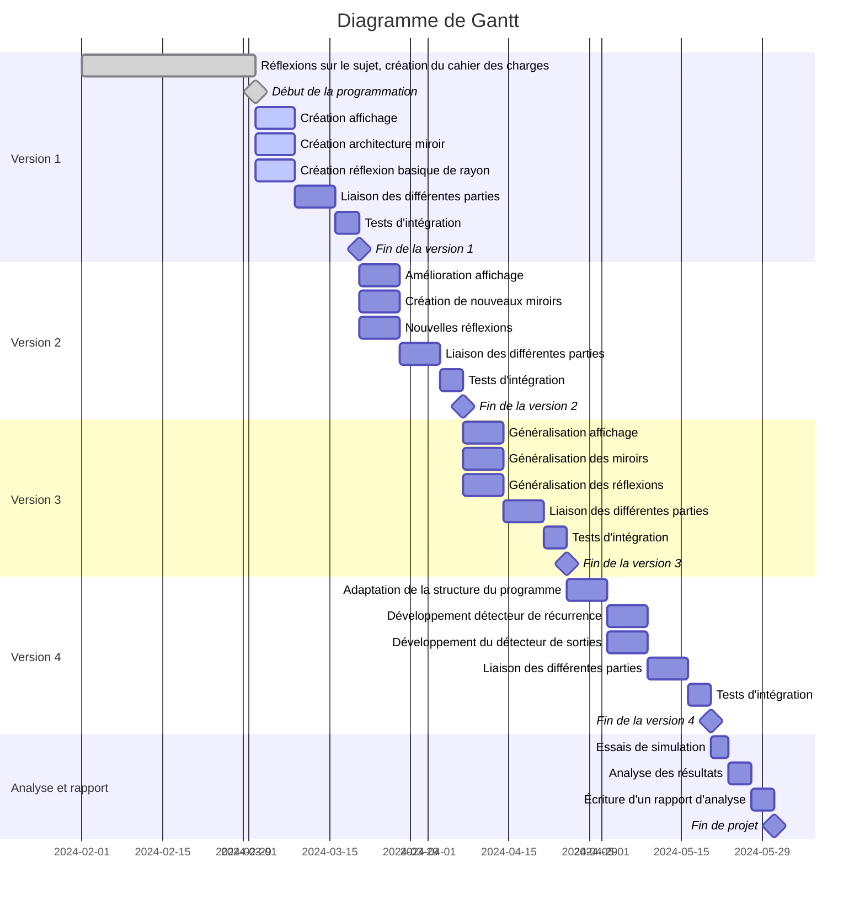

# MirrorVerse

Élèves : Guillaume Calderon, Mohammed Ali, Eymeric Déchelette

Enseignant : Jérôme Bastien

## Cahier des charges

### Contexte

Ce projet fait suite à la demande d'un étudiant, Quentin COURDEROT, en troisième année en spécialité informatique à Polytech. Il a demandé à son enseignant Jérôme Bastien de l'aider à écrire un algorithme pour déterminer la trajectoire d’un rayon lumineux lorsque celui-ci vient frapper un miroir plan fini.

### Objectif

L'objectif de ce projet est donc d'étudier le comportement d'un rayon lumineux lorsqu'il rencontre des miroirs. Il y a alors deux comportements possibles : le rayon peut être piégé dans le nid de mirroirs et se réfléchir à l'infini, ou il peut parvenir à sortir du nid de mirroirs. Sa trajectoire, quant à elle, peut suivre un motif ou bien être chaotique.   On considèrera qu'une trajectoire est chaotique si, après n réflexions (n dépendant du cas étudié), on ne constate aucune répétition.

Dans le cadre de ce projet, nous développerons un outil permettant de simuler et visualiser le comportement de rayons lumineux lorsqu'ils rencontrent des miroirs. La simulation devra autant que possible être juste physiquement, c'est à dire qu'elle devra coller au maximum à la réalité. Elle s'appuiera sur la seconde loi de Snell-Descartes (réflexion) et devra fonctionner au minimum en 2 dimensions et avec des miroirs plans.

La simulation pourra par la suite être enrichie, en prenant en compte par exemple plus de dimensions ou en intégrant un plus grande variété de miroirs.

### Réponse Technique

Pour répondre au mieux aux exigences de ce projet, le simulateur sera développé avec le langage Rust. Ce dernier est un langage de choix pour la création de programmes très rapides, notamment de par sa nature de langage compilé.
Celui ci permettra aussi d'intégrer facilement des tests automatisés afin d'avoir un code le plus robuste possible.

On utilisera la bibliothèque nAlgebra, qui nous permettra de manipuler aisément différentes notions mathématiques telles que les vecteurs, les points, etc.

La simulation intégrera de plus un outil de visualisation permettant de se déplacer dans le monde virtuel comprenant les miroirs et rayons simulés. Cela permettra de constater simplement et rapidement le résultat de la simulation.

### Difficultés Attendues

Pour la réalisation de ce projet, nous avons identifié deux difficultés majeures. La première concerne la détection de l'intersection entre les rayons et les miroirs. Celle-ci se doit d'être exacte, car toute imprécision, même minime, se traduira par de gros écarts entre la simulation et la réalité après un grand nombre de réflexions.
Elle devra également être trés rapide afin de pouvoir réaliser des simulation complexes avec beaucoup de mirroirs et de réflexions.

La deuxième difficulté concerne la technologie d'affichage. Elle demandera beaucoup de recherches documentaires pour se former sur cette technologie relativement nouvelle et complexes (simulation d'un monde 3D, matrices de vue et de projection...).
Cela risque un potentiel retard. C'est pourquoi nous rajouterons impérativement une fonction d'export des résultats dans un fichier JSON afin de pouvoir récupérer les données de la simulation sans passer par la visualisation interne au programme.
Cette fonctionnalité permettra en outre d'exporter ces données dans un autre logiciel afin de poursuivre l'étude au dela du cadre de ce projet.

### Milestones

Pour ce projet, nous prévoyons 4 milestones, qui seront autant de différentes versions du programme. Chaque version apportera des fonctionnalités supplémentaires.

#### Fonctionnalités v1

Pour cette première version, on devra pouvoir:

- Configurer facilement l'ensemble des miroirs pour la simulation. Ceci se via une description en JSON.
- Choisir la direction et le point de départ du rayon.
- Visualiser aisément le trajet du rayon lumineux.

Cette simulation devra de plus supporter les miroirs plan et fonctionner en 2D.
Cette première version utilisera cependant déjà des bases locales et des symétries plutôt que des angles afin d'anticiper la généralisation en 3D.

##### WorkPackages

Pour cette milestone ces workpackage devront être réalisés :

|               Nom                |                                                Description                                                 |  Durée  |
|:--------------------------------:|:----------------------------------------------------------------------------------------------------------:|:-------:|
|        Création affichage        |                                 La création d'une affichage en 2D basique                                  | 7 jours |
|   Création architecture miroir   |                Écriture de la modélisation des mirroirs et l'import depuis un fichier json                 | 7 jours |
| Création réflexion basique rayon |                                  Implémentation des réflexions des rayons                                  | 7 jours |
| Liaison des différentes parties  |                             Connecter toutes les parties précédentes ensemble                              | 7 jours |
|       Tests d'intégration        | Écriture de tests afin d'assurer que toutes les fonctionnalités de cette milestone fonctionnent comme pévu | 4 jours | 

#### Fonctionnalités v2

Cette deuxième version devra supporter les types de miroirs suivants :

+ plan
+ circulaires
+ $color(red)"en courbe de Bézier"$

##### WorkPackages

| Nom                             | Description                                                                              | Durée   |
|---------------------------------|------------------------------------------------------------------------------------------|---------|
| Amélioration affichage          | Amélioration de l'affichage en 2D                                                        | 7 jours |
| Création de nouveaux miroirs    | Ajout de la gestion des miroirs circulaires et en courbe de Bézier                       | 7 jours |
| Nouvelles réflexions            | Ajout de fonctionnalités pour gérer les nouvelles réflexions                             | 7 jours |
| Liaison des différentes parties | Connecter les nouvelles fonctionnalités ajoutées                                         | 7 jours |
| Tests d'intégration             | Écriture de tests pour assurer que les nouvelles fonctionnalités fonctionnent comme pévu | 4 jours |

#### Fonctionnalités v3

L'objectif minimal de la troisième version est d'obtenir une simulation fonctionnant en 3D. Son fonctionnement en nD serait un plus (facultatif en fonction du temps à disposition et des difficultés rencontrées).

##### WorkPackages

| Nom                             | Description                                                            | Durée   |
|---------------------------------|------------------------------------------------------------------------|---------|
| Généralisation affichage        | Mise en place d'un affichage en 3D (ou nD)                             | 7 jours |
| Généralisation des miroirs      | Gestion de miroirs en 3D (ou nD)                                       | 7 jours |
| Généralisation des réflexions   | Adaptation des réflexions pour le passage en 3D (ou nD)                | 7 jours |
| Liaison des différentes parties | Connexion des différentes fonctionnalités pour la 3D (ou nD)           | 7 jours |
| Tests d'intégration             | Ajout de tests pour vérifier l'intégrité des nouvelles fonctionnalités | 4 jours |

#### Fonctionnalités v4

Enfin, la quatrième version, facultative, pourra intégrer, selon les besoins, des fonctionnalités d'analyse de la trajectoire du rayon. $"On pense notamment à la " color(red)"détection automatique de la sortie du rayon de l'ensemble de miroirs"$, ou à la détection automatique d'une boucle (le rayon passe 2 fois au même endroit).

##### WorkPackages

| Nom                                     | Description                                                                                   | Durée   |
|-----------------------------------------|-----------------------------------------------------------------------------------------------|---------|
| Adaptation de la structure du programme | Révision de la structure du programme pour intégrer les nouvelles fonctionnalités d'analyse   | 7 jours |
| Développement détecteur de boucles      | Ajout d'un détecteur pour identifier les trajectoires récurrentes                             | 7 jours |
| Développement du détecteur de sorties   | Ajout d'un détecteur pour identifier les sorties du rayon du nid de miroirs                   | 7 jours |
| Liaison des différentes parties         | Connexion des nouveaux détecteurs avec le reste du programme                                  | 7 jours |
| Tests d'intégration                     | Écriture de tests pour vérifier le bon fonctionnement des nouvelles fonctionnalités d'analyse | 4 jours |

## fonctionalité ajouté

- $:l\color{violet}\text{Génération aléatoir d'ensemble de miroirs}$
- $:l\color{violet}\text{Interface graphique de pour la selection des différentes simulations}$
- $:l\color{violet}\text{Dévelopement du simulateur sous forme de librairie pour de potentiels utilisations future}$
- $:l\color{violet}\text{Affichage du départ du rayon lumineux}$

## Organisation temporelle

