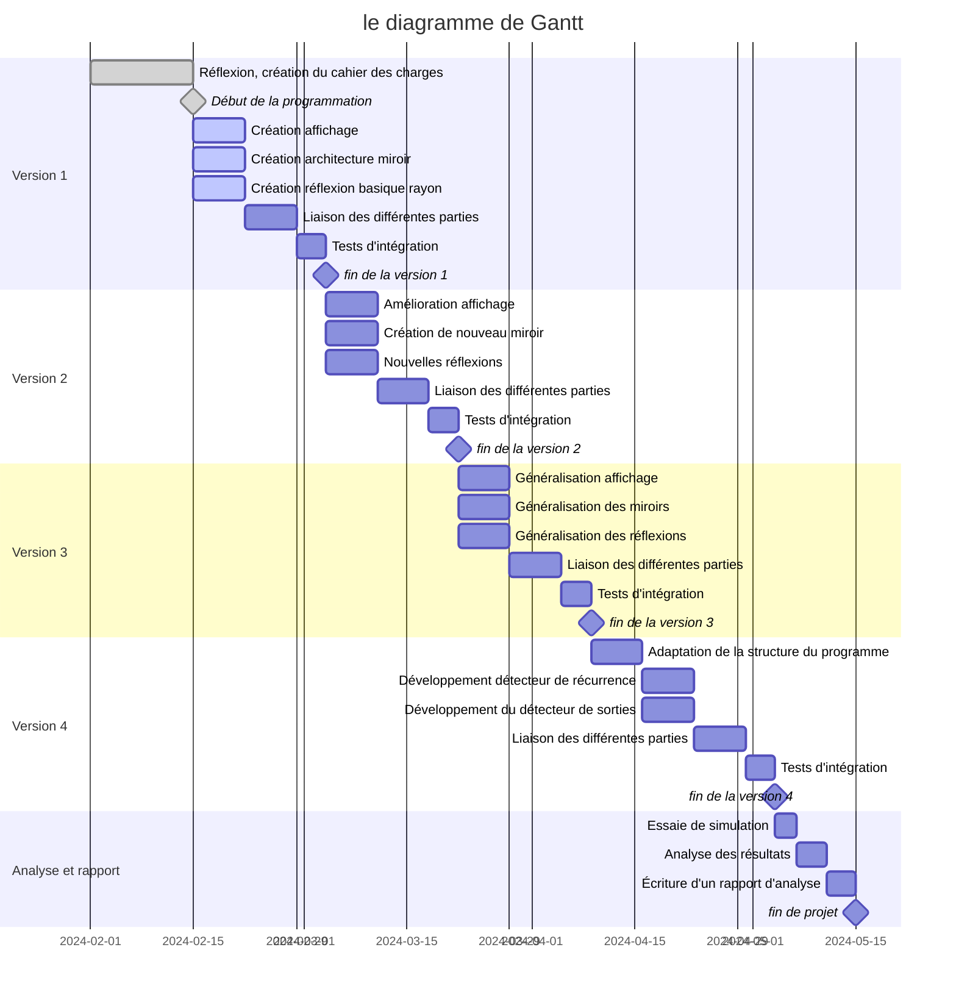

# MirrorVerse

Élèves : Guillaume Calderon, Mohammed Ali, Eymeric Déchelette

Enseignant : Jérôme Bastien

## Cahier des charges

### Contexte

Ce projet fait suite à une demande d'élève, Quentin COURDERO, en troisième année en informatique à Polytech. Il a demandé à son enseignant Jérôme Bastien de l'aider à écrire un algorithme pour déterminer la trajectoire d’un rayon lumineux lorsque celui-ci vient frapper un miroir plan fini. 

### Objectif

L'objectif de ce projet est donc d'étudier le comportement d'un rayon lumineux lorsqu'il rencontre des miroirs. Ce dernier a alors deux comportements possibles : il peut être piégé dans le nid de mirroirs et se réfléchir à l'infini, ou il peut parvenir à sortir du nid de mirroirs. Sa trajectoire, quant à elle, peut suivre un motif ou être chaotique. 
  On considérera qu'une trajectoire est chaotique si, après n réflexions (n dépendant du cas étudié), on ne constate aucune répétition.

Dans le cadre de ce projet, nous coderons un outil simulant le comportement de rayons lumineux lorsqu'ils rencontrent des miroirs. La simulation devra être juste physiquement, c'est à dire qu'elle devra coller au maximum à la réalité. Elle s'appuiera sur la seconde loi de Snell-Descartes (réflexion) et devra obligatoirement fonctionner en 2 dimensions avec des miroirs plans. 

La simulation pourra par la suite être enrichie, en prenant en compte par exemple plus de dimensions ou en intégrant un plus grande variété de miroirs.

### Réponse Technique

Pour répondre au mieux aux exigences de ce projet, le simulateur sera développé avec le langage Rust. Afin d'obtenir une vitesse d'éxecution la plus rapide possible car c'est un language compilé.
Celui ci permettra aussi d'intégrer simplement des test automatisé afin d'avoir un code le plus rebuste possible.

On utilisera la bibliothèque nAlgebra qui nous permettra de manipuler aisément différentes notions mathématiques telles que les vecteurs, les points, etc.

La simulation intégrera de plus un outil de visualisation permettant de se déplacer dans le monde virtuel comprenant les miroirs et rayons simulés. Cela permettra de constater simplement et rapidement le résultat de la simulation. Cet outil de visualisation sera développé à l'aide de la bibliothèque wgpu.

### Difficultés Attendues

Pour la réalisation de ce projet, nous avons identifié deux difficultés majeures. La première concerne la détection de l'intersection entre les rayons et les miroirs. Celle-ci se doit d'être exacte, car toute imprécision, même minime, se traduira par de gros écarts entre la similation et la réalité après un grand nombre de réflexions. 
Elle devra également être trés rapide afin de pouvoir réaliser des simulation complexe avec beaucoup de mirroirs et de réfléxions.

La deuxième difficulté concerne la technologie d'affichage. Elle demandera beaucoup de recherches documentaires car les réalisateurs du projet auront besoin de se former sur cette technologie relativement nouvelle pour eux.
Cela risque un potentiel retard.

### Milestones

Pour ce projet, nous prevoyons 4 milestones, qui seront différentes versions de l'algorithme. Chaque version apportera des fonctionnalités supplémentaires. 

#### Fonctionnalités v1
Pour cette première version, on devra pouvoir:
- Configurer facilement l'ensemble des miroirs pour la simulation. Ceci se fera probablement via une description en JSON.
- Choisir la direction et le point de départ du rayon.
- Visualiser aisément le trajet du rayon lumineux.

Cette simulation devra de plus supporter les miroirs plan et fonctionner en 2D.
Cette première version utilisera cependant déjà des bases locales et des symétries plutôt que des angles afin d'anticiper la généralisation en 3D.

##### WorkPackages

Pour cette milestone ces workpackage devront être réalisé : 

|nom|description|durée|
|:-:|:---------:|:---:|
|Création affichage|La création d'une affichage en 2d basique|7 jours|
|Création architecture miroir|ecriture de la modélisation des mirroir et l'import depuis du json|7 jours|
|Création réflexion basique rayon|Implementation des réfléxion des rayons|7 jours|
|Liaison des différentes parties|Connecter toute les parties précédente ensemble|7 jours|
|Tests d'intégration|Écriture de tests afin d'assurer que les future versions ne casse par cette milestone|4 jours| 

#### Fonctionnalités v2
Cette deuxième version devra supporter les types de miroirs suivants :
+ plan,
+ circulaire,
+ en courbe de Bézier.

##### WorkPackages

| Nom                        | Description                                              | Durée  |
|----------------------------|----------------------------------------------------------|--------|
| Amélioration affichage     | Amélioration de l'affichage en 2D                        | 7 jours|
| Création de nouveaux miroirs | Ajout de la gestion des miroirs circulaires et en courbe de Bézier | 7 jours|
| Nouvelles réflexions       | Ajout de fonctionnalités pour gérer les nouvelles réflexions | 7 jours|
| Liaison des différentes parties | Connecter les nouvelles fonctionnalités ajoutées | 7 jours|
| Tests d'intégration        | Écriture de tests pour assurer l'intégrité du code avec les nouvelles fonctionnalités | 4 jours|

#### Fonctionnalités v3
L'objectif minimal de la troisième version est d'obtenir une simulation fonctionnant en 3D. Son fonctionnement en nD serait un plus.

##### WorkPackages

| Nom                               | Description                                              | Durée  |
|-----------------------------------|----------------------------------------------------------|--------|
| Généralisation affichage          | Mise en place d'un affichage en 3D                       | 7 jours|
| Généralisation des miroirs        | Gestion de miroirs en 3D                                 | 7 jours|
| Généralisation des réflexions     | Adaptation des réflexions pour le passage en 3D          | 7 jours|
| Liaison des différentes parties  | Connexion des différentes fonctionnalités pour la 3D     | 7 jours|
| Tests d'intégration               | Ajout de tests pour vérifier l'intégrité des nouvelles fonctionnalités | 4 jours|

#### Fonctionnalités v4
Enfin, la quatrième version facultatif, pourra intégrer, selon les besoins, des fonctionnalités d'analyse de la trajectoire du rayon. On pense notamment à la détection automatique de la sortie du rayon de l'ensemble de miroirs, ou à la détection automatique d'une boucle (le rayon passe 2 fois au même endroit).

##### WorkPackages

| Nom                                     | Description                                              | Durée  |
|-----------------------------------------|----------------------------------------------------------|--------|
| Adaptation de la structure du programme | Révision de la structure du programme pour intégrer les nouvelles fonctionnalités d'analyse | 7 jours|
| Développement détecteur de récurrence  | Ajout d'un détecteur pour identifier les trajectoires récurrentes | 7 jours|
| Développement du détecteur de sorties  | Ajout d'un détecteur pour identifier les sorties du rayon de l'ensemble de miroirs | 7 jours|
| Liaison des différentes parties        | Connexion des nouveaux détecteurs avec le reste du programme | 7 jours|
| Tests d'intégration                    | Écriture de tests pour vérifier le bon fonctionnement des nouvelles fonctionnalités d'analyse | 4 jours|

## Organisation temporelle

