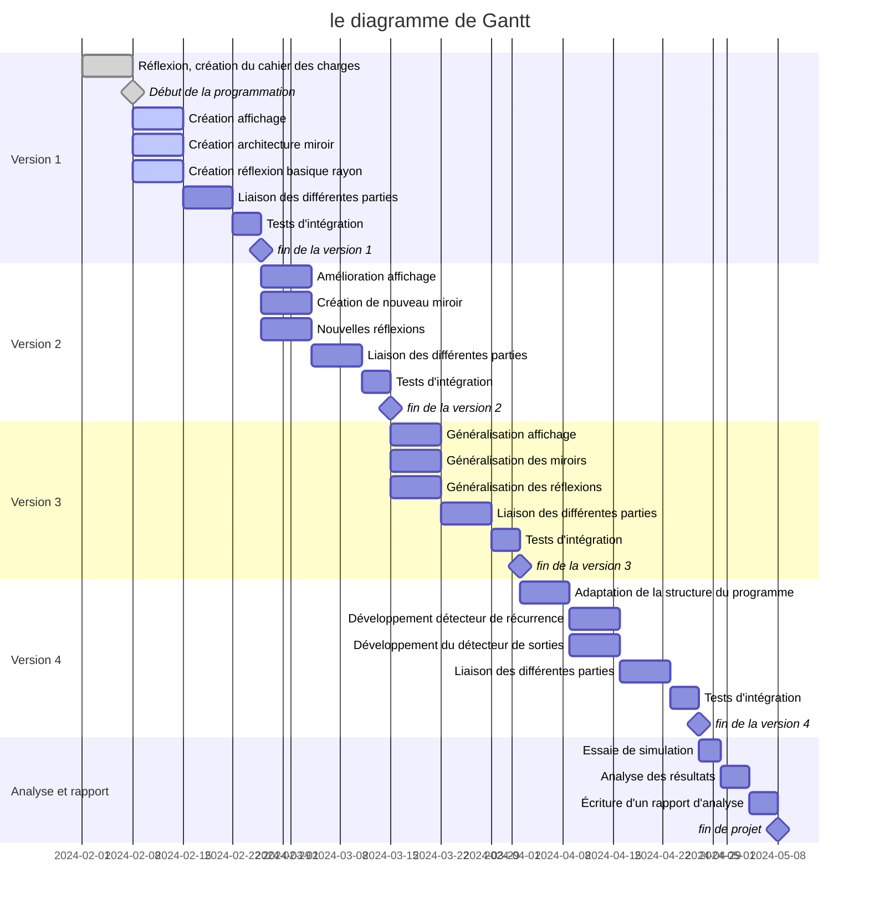

# Mirror verse

## cahier des charges

### objectif

L'objectif de ce projet est d'étudier le comportement d'un rayon lumineux à la rencontre de miroirs.

On étudiera, par exemple, si, en envoyant le rayon lumineux sur un grand nombre de miroirs, la trajectoire est chaotique ou si le rayon finit par sortir de l'ensemble des miroirs.

On considérera qu'une trajectoire est chaotique si, après n réflexion, on ne constate aucune récurrence.

### réponse technique

Pour ce faire, on écrira un outil de simulation des rayons lumineux avec des miroirs.

La simulation devra physiquement être juste. (coller au maximum à la réalité dans tous les cas.)

La simulation s'appuiera sur la seconde loi de Snell-Descarte sur la réflexion.

Le simulateur sera développé avec le langage Rust afin d'avoir un maximum d'optimisation et de s'assurer d'un minimum de bugs imprévus.

La simulation disposera d'un outil de visualisation permettant de se déplacer dans le monde virtuel pour constater simplement le résultat de la simulation.

#### fonctionnalité v1

- On devra pouvoir éditer facilement l'ensemble des miroirs pour la simulation. Probablement via une simple description en JSON.
- On devra également pouvoir choisir la direction et le point de départ du rayon.
- On devra pouvoir visualiser aisément le trajet du rayon lumineux.
- On devra supporter les miroirs plans.
- La simulation devra au moins fonctionner en 2D.
 La V1 utilisera des bases locales et des symétries plutôt que des angles afin d'anticiper la généralisation en 3D.

#### fonctionnalité v2

- On devra supporter les types de miroirs :
    + plan
    + circulaire
    + en courbe de Bézier

#### fonctionnalité v3

- La simulation devra au moins fonctionner en 3D (ou ND).

#### Fonctionnalités v4

- on devra ajouter, selon les besoins, des fonctionnalités d'analyse de la trajectoire du rayon :
    + détection automatique de la sortie de l'ensemble.
    + détection automatique d'une boucle (le rayon passe 2 fois au même endroit)

## organisation temporelle

